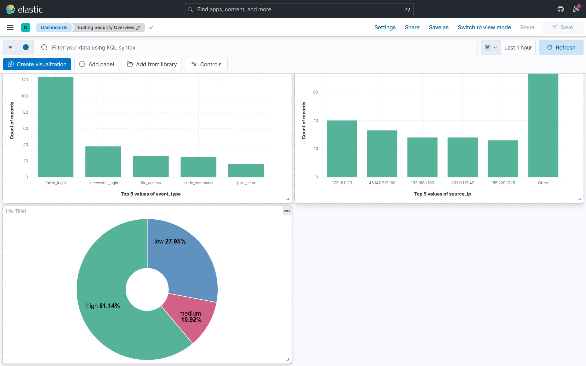

# Mini Log Pipeline 🔍

A local Security Analytics Pipeline for detecting and visualizing brute-force attacks.
Built as a portfolio project for a Big Data / Security & Operations Analytics trainee application.

## What it does

- Generates realistic security log events (failed logins, port scans, sudo commands)
- Ships logs via Filebeat into Elasticsearch
- Visualizes attack patterns in a Kibana dashboard
- Detects brute-force patterns: 50% of events are failed logins from rotating IPs

## Architecture

Python Log Generator
│
▼
logs/app.log
│
▼
Filebeat (Docker)
│
▼
Elasticsearch (Docker) ──► Kibana Dashboard (localhost:5601)


## Tech Stack

| Component      | Tool                  | Version |
|----------------|-----------------------|---------|
| Log Generator  | Python 3              | 3.x     |
| Log Shipper    | Filebeat              | 8.13.0  |
| Data Store     | Elasticsearch         | 8.13.0  |
| Dashboard      | Kibana                | 8.13.0  |
| Container      | Docker + Compose      | latest  |

## Dashboard



*Kibana dashboard showing event types, top attacker IPs, and severity distribution*

## Quick Start

**Prerequisites:** Docker Desktop, Python 3

```bash
# 1. Clone the repo
git clone https://github.com/anhieb/mini-log-pipeline.git
cd mini-log-pipeline

# 2. Start Elasticsearch and Kibana
docker compose up -d

# 3. Generate logs
python src/log_generator.py

# 4. Start Filebeat (after logs are generated)
docker compose --profile full up -d

# 5. Open Kibana
# http://localhost:5601
```

## Project Structure

```
mini-log-pipeline/
├── docker-compose.yml    # Elasticsearch, Kibana, Filebeat
├── filebeat.yml          # Filebeat configuration
├── src/
│   └── log_generator.py  # Generates security events
├── logs/
│   └── app.log           # Generated log file (auto-created)
└── docs/
    └── dashboard.png     # Kibana dashboard screenshot
```

## Key Concepts Demonstrated

- **Log pipeline architecture** – from source to visualization
- **Docker Compose** – multi-container orchestration
- **Elasticsearch indexing** – daily rolling indices (`security-logs-YYYY.MM.DD`)
- **Kibana Lens** – building dashboards from raw log data
- **Brute-force simulation** – weighted random event generation

## Background

This project was built to demonstrate practical skills in:
- Big Data pipeline architecture (Elastic Stack)
- Security & Operations Analytics
- Container-based infrastructure (Docker)
- Python scripting for data generation
